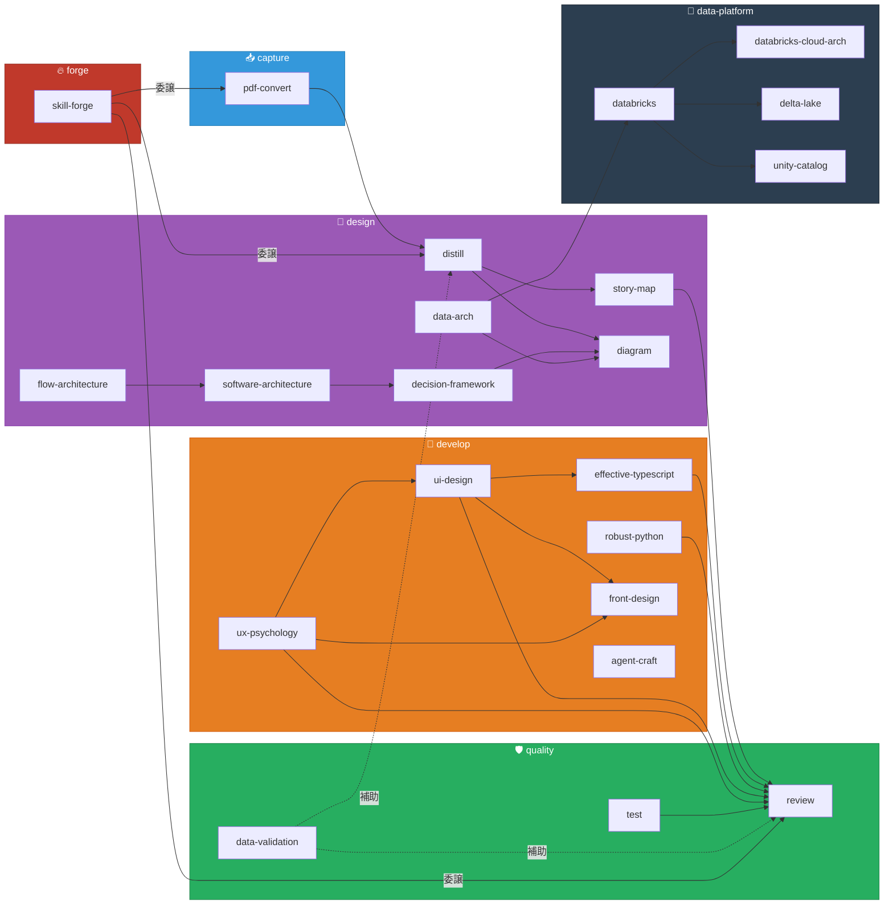

# Skills Index

> `.agent/skills/` に収録された全 22 スキルのカテゴリマップ。
> エンジニアリング / アーキテクチャ設計ワークフローに沿った 6 カテゴリで整理しています。
>
> ※ 本リポジトリは [My-Agent-Skills](https://github.com/bogard7056/My-Agent-Skills)（39 スキル）から
> アジャイル開発・アーキテクチャ設計に必要なスキルを抽出したサブセットです。

---

## カテゴリ俯瞰

---

## 📥 capture — 情報取り込み

顧客から受領した資料をテキスト化し、後続工程で分析可能な形にする。

| スキル | バージョン | 概要 | トリガー例 |
|:---|:---:|:---|:---|
| [pdf-convert](pdf-convert/SKILL.md) | v1.3.0 | PDF/DOCX/PPTX を Markdown に変換。Docling によるローカル処理、OCR 対応 | 「PDF を変換して」「inbox に取り込んで」 |

---

## 📐 design — 上流設計

要件の整理・構造化からアーキテクチャ設計、図面生成まで。

| スキル | バージョン | 概要 | トリガー例 |
|:---|:---:|:---|:---|
| [distill](distill/SKILL.md) | v1.6.0 | ソース資料（inbox）→ 構造化仕様（notes）への蒸留。用語集・ドメインモデル・ビジネスルール策定 | 「inbox を notes に蒸留して」「ドメインモデルを作成して」 |
| [story-map](story-map/SKILL.md) | v1.3.0 | Jeff Patton 型ユーザーストーリーマッピング。ペルソナ抽出・フィーチャー洗い出し・リリース計画策定 | 「ストーリーマップを作成して」「MVP を定義して」 |
| [diagram](diagram/SKILL.md) | v1.3.0 | draw.io 図面（.drawio）の自動生成。Azure/AWS クラウドアイコン対応 | 「アーキテクチャ図を描いて」「ER 図を作って」 |
| [data-arch](data-arch/SKILL.md) | v1.1.0 | 『Deciphering Data Architectures』に基づく 6 種アーキテクチャ比較評価・ADS 実施・データモデリング | 「データアーキテクチャを選定して」「DWH を設計して」 |
| [software-architecture](software-architecture/SKILL.md) | v1.1.0 | 『Fundamentals of Software Architecture 2nd Ed.』に基づくアーキテクチャ設計・評価・ADR | 「アーキテクチャを設計して」「モノリスかマイクロサービスか判断したい」 |
| [flow-architecture](flow-architecture/SKILL.md) | v1.1.0 | Wardley Mapping × DDD × Team Topologies によるフローアーキテクチャ設計 | 「フローアーキテクチャを設計して」「レガシーシステムを近代化したい」 |
| [decision-framework](decision-framework/SKILL.md) | v1.1.0 | ADR・トレードオフ評価・DACI/RACI・リスクストーミング | 「ADR を管理したい」「トレードオフを分析して」「リスク評価をして」 |

---

## 🔨 develop — 実装支援

書籍ベースのベストプラクティスを適用し、保守性の高いコードを書く。

| スキル | バージョン | 概要 | トリガー例 |
|:---|:---:|:---|:---|
| [effective-typescript](effective-typescript/SKILL.md) | v1.1.0 | 『Effective TypeScript 第 2 版』（83 項目）に基づく TS 設計・レビュー | 「TS のコードをレビューして」「any を減らしたい」 |
| [robust-python](robust-python/SKILL.md) | v1.1.0 | 『ロバスト Python』（24 章）に基づく型設計・クラス設計・拡張性改善 | 「Python のコードをレビューして」「型を設計して」 |
| [ui-design](ui-design/SKILL.md) | v1.2.0 | 『Refactoring UI』に基づく UI 設計・レビュー・改善。視覚的階層、カラー、タイポグラフィ | 「UI を改善して」「配色を決めて」 |
| [ux-psychology](ux-psychology/SKILL.md) | v1.2.0 | 『Laws of UX』10 法則に基づく UX 心理学レビュー・設計 | 「UX 心理学でレビューして」「認知負荷を減らしたい」 |
| [front-design](front-design/SKILL.md) | v1.2.0 | LP・ウェブサイトのフロントエンドデザイン戦略・アセット生成 | 「LP を作りたい」「ウェブサイトのデザイン」「画像素材を探して」 |
| [agent-craft](agent-craft/SKILL.md) | v1.2.0 | Claude Code カスタムエージェント（.claude/agents/）の設計・生成 | 「カスタムエージェントを作って」「エージェントを設計して」 |

---

## 🛡️ quality — 品質保証

データ・テスト・成果物の品質を多角的に検証し、品質ゲートを通過させる。

| スキル | バージョン | 概要 | トリガー例 |
|:---|:---:|:---|:---|
| [data-validation](data-validation/SKILL.md) | v1.4.0 | テーブル構造・データ品質・スキーマ整合・ルール整合・数値整合の 5 種検証 | 「テーブルの整合性をチェックして」「CSV を検証して」 |
| [test](test/SKILL.md) | v1.1.0 | Khorikov の 4 本柱で価値の高い単体テストを設計・生成・レビュー | 「単体テストを書いて」「モックの使い方を見直して」 |
| [review](review/SKILL.md) | v1.7.0 | 成果物（ドキュメント・コード・設計書）のクリティカルレビュー（A-1〜A-4 / B-1〜B-6） | 「ドキュメントをレビューして」「要件カバレッジをチェックして」 |

---

## 🔷 data-platform — データプラットフォーム

Databricks を中心としたデータプラットフォームの設計・構築・最適化を支援。

| スキル | バージョン | 概要 | トリガー例 |
|:---|:---:|:---|:---|
| [databricks](databricks/SKILL.md) | v1.1.0 | Databricks プラットフォーム設計・構築（Workspace、Medallion、DLT、MLflow、DBSQL、CI/CD） | 「Databricks の設計をして」「Medallion Architecture を設計して」 |
| [databricks-cloud-arch](databricks-cloud-arch/SKILL.md) | v1.1.0 | Databricks × AWS/Azure クラウドインフラアーキテクチャ（VPC/VNet、PrivateLink、IAM、Terraform） | 「Databricks の VPC を設計して」「Databricks の Terraform を書いて」 |
| [delta-lake](delta-lake/SKILL.md) | v1.1.0 | Delta Lake テーブル設計・最適化・運用（Liquid Clustering、MERGE、OPTIMIZE/VACUUM） | 「Delta Lake のテーブルを設計して」「MERGE のパフォーマンスを改善して」 |
| [unity-catalog](unity-catalog/SKILL.md) | v1.1.0 | Unity Catalog 設計・構築・移行（ABAC、Delta Sharing、Hive 移行、Terraform） | 「Unity Catalog を設計して」「Hive から UC に移行したい」 |

---

## 🔥 forge — スキル開発

スキル自体の品質を高め、新しいスキルを鋳造するメタスキル。

| スキル | バージョン | 概要 | トリガー例 |
|:---|:---:|:---|:---|
| [skill-forge](skill-forge/SKILL.md) | v1.3.0 | 知識ソースからスキルを鋳造するオーケストレーター | 「スキルを作って」「PDF からスキルを作って」「書籍をスキル化して」 |

---

## Tier 分類

| Tier | スキル数 | 使用タイミング | スキル一覧 |
|:---|:---:|:---|:---|
| **Tier 1: コア** | 8 | 毎スプリント | distill, story-map, diagram, robust-python, effective-typescript, test, data-validation, review |
| **Tier 2: 設計** | 5 | 案件タイプに応じて | pdf-convert, data-arch, ui-design, ux-psychology, front-design |
| **Tier 3: アーキテクチャ** | 3 | アーキテクチャ設計フェーズ | software-architecture, flow-architecture, decision-framework |
| **Tier 4: データ基盤** | 4 | データ基盤案件 | databricks, databricks-cloud-arch, delta-lake, unity-catalog |
| **Tier 5: ツーリング** | 2 | プロセス改善・スキル開発 | agent-craft, skill-forge |
